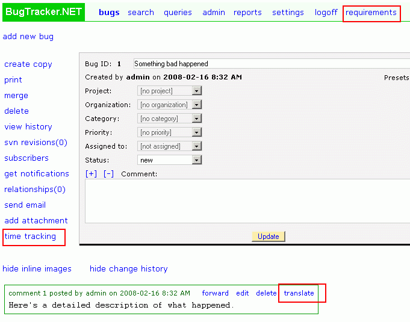

=====================
Adding your own pages
=====================
You can add your own additional links and pages to BugTracker.NET. If you want to add your own link to the main links that run across the page, use the "CustomMenuLinkLabel/Url" settings in Web.config. If you want to add your own bug-specific link to the edit_bug.aspx page, use the "CustomBugLinkLabel/Url" settings. You can also add your own link at the level of a bug post using the "CustomPostLinkLabel/Url" settings.

The file "translate.aspx" is a fun sample that demonstrates a custom page at the post level.

See Web.config for details.

Another way of integrating your BugTracker.NET with your own web pages is to add your own links in the custom_header.html and custom_footer.html files. For details, see the Appearance page.

**CustomMenuLink, CustomBugLink, CustomPostLink:**

