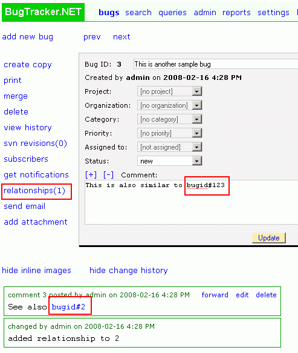

=================
Bug relationships
=================
There are two ways to create relationships between bugs:

1.Create hyperlinks to other bugs in your bug comments by using the format bugid#999 where 999 is the number of the bug you want to link to.

2.Create relationships between bugs by clicking on the "relationships" link and accessing the "add relationship page".

**Creating relationship between bugs:**

**Clicking on "relationships" brings up this page:**

.. image:: images/bug_tracker_related2.gif