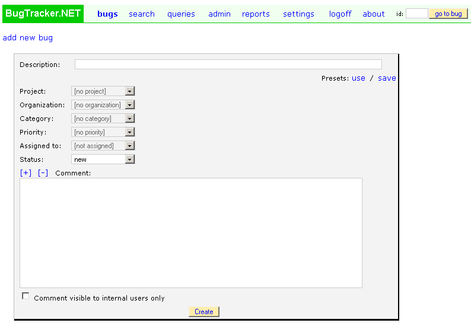

===============
Custom Fields
===============
You can enter bugs immediately after setup, but you probably want to make some configuration changes first.

Log in as "admin" and click on the "admin" link along the top. You should now be viewing a page with links to "users", "projects", "categories", "priorities", and "statuses". Add/delete/change the values according to your needs.

When you first install BugTracker.NET, there are only these half-dozen or so fields on the "edit_bug.aspx" page. Many people add more, for example "Version Fixed", "Due Date", etc. There are three ways to add custom fields:

1. "user defined attribute" - This is the simplest way to add one custom field. You can use the simple "user defined attribute" dropdown that applies to all projects. Edit these lines in Web.config to use and name this additional dropdown:

.. sourcecode:: xml
    <add key="ShowUserDefinedBugAttribute" value="1"/>
    <add key="UserDefinedBugAttributeName" value="YourAttribute"/>

2. "custom field" - You can add custom columns to the bug table and they will show up in the edit bug page and the search page. See the admin "custom fields" page. The fields you add here apply to all projects. You can add as many custom fields as you want.

**Custom fields for all projects:**
.. image:: /images/admin_custom_fields_link.gif

**Add custom field page:**
.. image:: images/add_custom_field_page.gif

Read the comments in small green text on the "add custom field" page carefully if you are having trouble using the page.

3. Project "custom dropdown" - You can add custom dropdowns to individual projects when you edit a project. These project-specific dropdowns are appropriate for listing version numbers that only apply to a specific project, or listing components that only apply to a specific project.

**Custom fields for a specific project:**
.. image:: images/project_custom_fields.gif

BugTracker.NET is already very simple, but, if instead of adding more fields, you want to have FEWER fields to show, there are two ways to hide fields.

1) Edit the css files. For more on editing the css files, see the Appearance page.

2) Configure the user organinzation permissions. You can make fields hidden, read-only, or editable by organization. For more on permissions see the User Permissions page.

Below are three screenshots showing the "add a bug" page. The first shows the default installation. The second shows the same page after custom fields of various types have been added. The third page shows the same page with the built-in fields hidden using css.

**Default. Before customization:**

**More complex: After some custom fields have been added:**
.. image:: images/bug_tracker_custom.gif

**Very simple! After built-in-fields have been hidden:**
.. image:: images/bug_tracker_barebones.gif