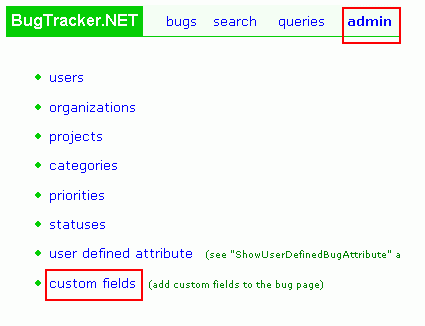

############
Custom Field
############

You can add custom columns to the bug table and they will show up in the edit bug page and the search page. See the admin "custom fields" page. The fields you add here apply to all projects. You can add as many custom fields as you want.

**Custom fields for all projects:**

**Add custom field page:**

.. image:: media/add_custom_field_page.gif

Read the comments in small green text on the "add custom field" page carefully if you are having trouble using the page.