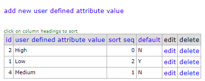
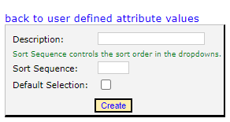
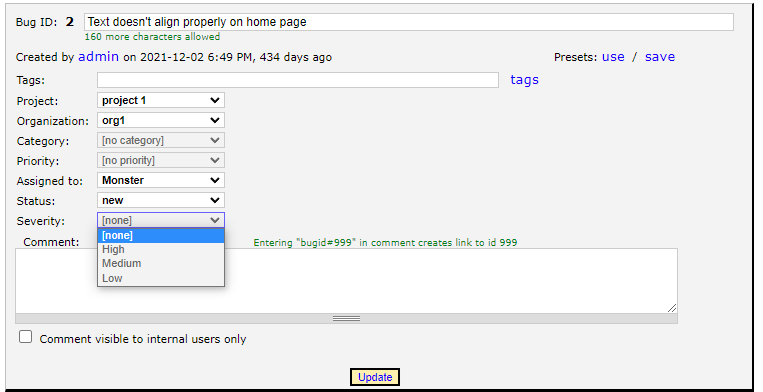

######################
User Defined Attribute
######################

A "User Defined Attribute" is the simplest way to add a custom field to a Bug. The user defined attribute is restricted to creating only **one dropdown field** that applies to all projects.

Viewing User Defined Attributes
-------------------------------
To see all of the values you have added go to **Admin > User Defined Attribute**. From this page you will see a list of any attributes you have added to the system.

Create a User Defined Attribute
-------------------------------
The first thing you need to do is to add values to the drop down box. Go to **Admin > User Defined Attribute**. Once on this page you will see a list of attributes that you have added. Click the "add new user defined attribute value" link and enter the name of the value in the *Description* field, as well as the sort sequence. The sort sequence controls the sort order of values in the the dropdown.

Turn on User Defined Attribute
-------------------------------
In order for the drop down list to show up, you will need to edit 2 lines in the Web.config file.

.. sourcecode:: xml
    
    <add key="ShowUserDefinedBugAttribute" value="1"/>
    <add key="UserDefinedBugAttributeName" value="YourAttribute"/>

The ``ShowUserDefinedBUgAttribute`` variable determines if the dropdown box will show. Set this to 1 for it to show, or 0 to hide it.
The ``UserDefinedBugAttributeName`` variable determines the field name of the dropdown box that will show on the bug form.

In the screen shot below, we have changed the ``UserDefinedBugAttrbuteName`` to "Severity" and added "High", "Medium", and "Low" to the attribute values. Now we have a Severity dropdown box that shows up on every bug, across all projects.

Edit User Defined Attribute
---------------------------
To edit an existing attribute, go to **Admin > User Defined Attribute** to see the list of attributes you have added. Click the "Edit" link, which will allow you to edit the name, sort sequence, and if it is the default selection. 

.. info:: 
    Any edits made, will affect all bugs in the system.

Delete User Defined Attribute
-----------------------------
To delete an attribute fiels, go to **Admin > User Defined Attribute** to see the list of attributes you have added. Click the "Delete" link which will take you to a confirmation page. If the attribute is attached to any bugs, regardless of the bug status, you will not be able to delete the attribute. 

