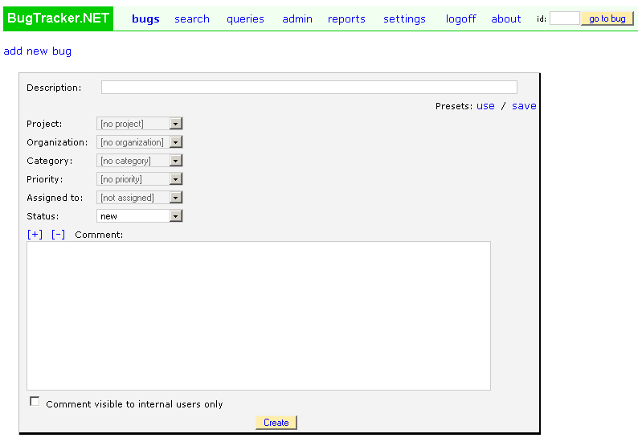

==========================
Customizing the Appearance
==========================
You can change the appearance of the BugTracker.NET web pages by editing the following files:

Web.config - The following lines in Web.config change the page titles from "BugTracker.NET" to "ABC Customer Support" and change the term "Bug" to "Item".
<add key="AppTitle" value="ABC Customer Support"/>
<add key="SingularBugLabel" value="Item"/>
<add key="PluralBugLabel" value="Items"/>
custom_logo.html - contains the HTML for the green and white "BugTracker.NET" logo.
custom_header.html - contains the HTML that appears across the top of every page. In the second screenshot below, the sun image and "ABC Software".
custom_footer.html - contains the HTML that appears at the bottom of every page. In the second screenshot below, the "privacy policy", "terms of service" and "contact" links.
btnet_custom.css - contains overrides to the default fonts, colors, and other CSS style related settings. It is overridding btnet_base.css
btnet_edit_bug.css, btnet_search_bug.css - can be used to control the appearance and location of specific labels and fields in the pages bugs.aspx and search.aspx.
 

Do be careful as you upgrade to newer releases of BugTracker.NET that you don't overlay your customized files. You should keep backups of any files that you customize in a safe place.

The custom html is cached by BugTracker.NET, so if you make changes, you need to refresh the cache. A quick way to do this is by just typing a blank character somewhere in Web.config.

Below are two screenshots to give you an idea of the changes you can make by editing the files listed here. The first screenshot shows BugTracker.NET's "add a bug" page after installation, before customization. The second screenshot shows it customized using the files previously described.

**Before customization:**

**After changes to custom_header.html, custom_footer.html, custom_logo.html, and btnet_custom.css:**

.. image:: images/bug_tracker_css.gif