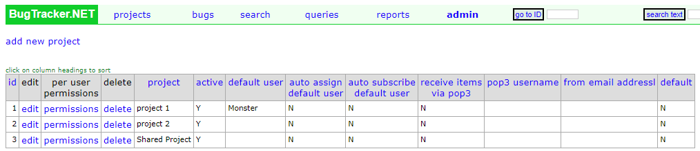

##################
Editing a Project
##################

.. note::

    Editing a project can only be done by a system administrator. 

****************
Edit a project
****************
To edit a project, click the **admin** link on the main menu, then click **Projects**, and then select the **edit** link next to the project you want to edit.

From here you can edit the main settings of the project, like the Project Name and Description. You can also edit the custom fields.

********************
Per user permission
********************
By default all new users will have all access to all projects. Although they may not be able to do view other bugs, they will still have access to see the project. 

To change this, click the **per user permissions** link at the top of the page. This will allow you to change the access to the project for each user in the system.

.. note::

    This page will show every user in the system, and it is not paginated. If you have hundreds of users, this page could see performance issues.