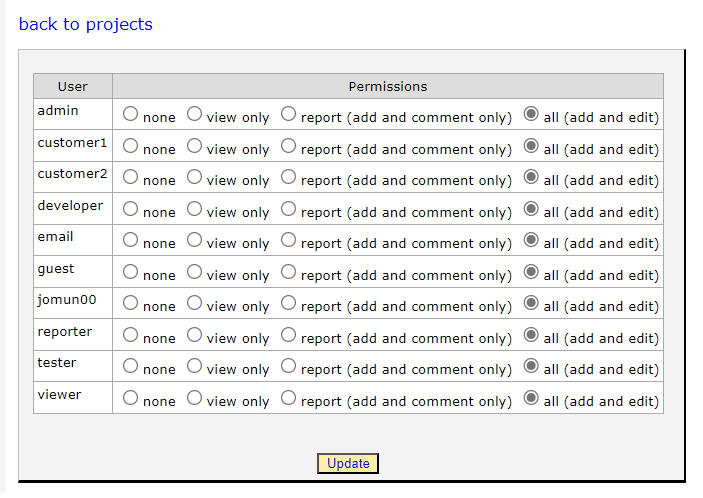
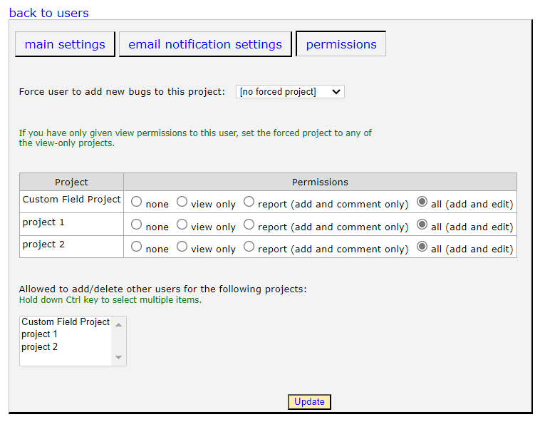

##################
Project Permissions
##################

.. note::

    Managing a project's permissions can only be done by a system administrator. 

There are two ways to manage user permissions for projects. The first is at the project level, and the second is at the user level. 

****************
Permission Levels
****************
There are four different Permission Levels for Users:
1. **none** - The user will not see or be able to interact with the Project in any way.
2. **view only** - The user will be able to see bugs in the project, but not be able to create, edit, or comment on any bug.
3. **report** - The user will be able to add new bugs, and add comments to existing bugs, but not able to edit any bugs, even if they are the creator. 
4. **all** - The user will have all access to create, edit, and delete bugs. 

****************
Managing Permissions By Project
****************
The easiest way to manage permissions is by going into the specific project. 

Click the **admin** link on the main menu, then click **Projects**. From here you can either select the **permissions** link for the specific project, or you can click the **edit** then the **per user permissions** link. Both of these will take you to the same screen. 

From here you will see all available users in the entire application.  Pick the permission level you would like each user to have for the specific project and click the **Update** button. 

.. note::

    This page lists all of the users in the entire system and goes through each of them to update. This can cause significant performance issues if you have a large amount of users. 

****************
Managing Permissions By User
****************
The other way to manage permissions is per user. 

Click the **admin** link on the main menu, then click **Users**. From here click the **edit** link, then **permissions**. This will take you to the following page.

Selecting the "Force user to add new bugs to this project" drop down will cause any bugs to be added to only that project. This is useful if you want someone that has View access to also be able to add new bugs, but not do anything else. 

In the Project table, you will see a list of projects and the permission level this user has for each project. You can change the permission level for each project needed. To save your changes press the **Update** button. 

****************
Project Admin
****************
You can create what is referred to in the system as a "Project Admin". This is a person that is allowed to add or delete other users from Projects. There are two settings that control this. 

First you must enable a seeting in the Organization that the user is in.
- From the Manage Organization screen, click **edit** for the specific Organization you want to update.
- In the middle of the settings check the box marked "Non-admin with permission to add users can add users to this org".

Then go to the User Management screen.
- Click **edit** for the specific user you would like to update.
- Click the **permissions** tab.
- In the multi-select box at the bottom of the page, select the project you would like them to be able to add users to.
