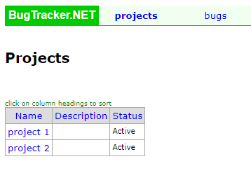
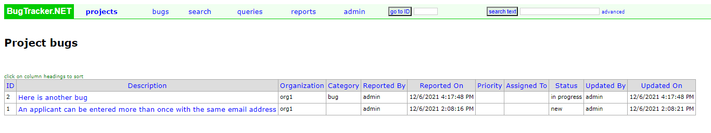
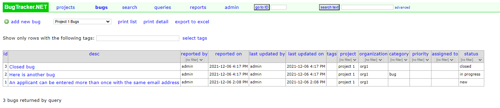

######################
Viewing Project Issues
######################

How to view projects
====================
You can view a list of projects by selecting the Projects link on the main menu. From there you will see a list of all projects you have access to. 

Viewing issues related to a project
====================================
There are two ways to view issues related to a specific project. 

The first is from the Project List page (shown above). Clicking on a specific project will take you to a page that shows all of the bugs related to that project.

By default, this view only shows active issues. Any closed issues are not shown.

The second way is by creating a query that is filtered for a specific project. 

Once you have the query created you can click the Bugs link on the main menu. This will take you to the Bugs page. From here you can select your query from the drop down box, which will then show you all of your bugs related to that project. This is the best way to view all closed bugs related to a specific project.

For more information on how to create queries see :doc:`Bug Queries <../bug-queries>`.
