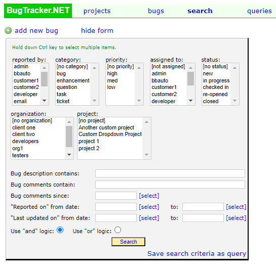
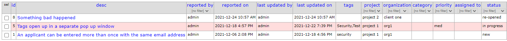
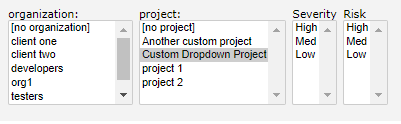
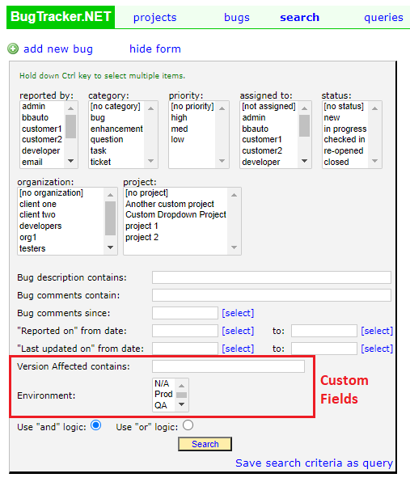
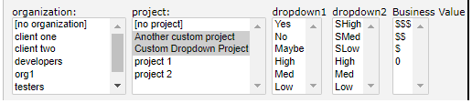

################
Advanced Search
################

The last way to search is by clicking on the "search" link on the main menu. This will take you to the Search page.

By default, if you just click the "Search" button it will return a list of all bugs.  To refine your search select the options you want from the list boxes. You can select multiple items in a list box by holding down the Ctrl button and clicking additional options. 

At the bottom of the Search page is an option to use "and" logic or "or" logic. The and / or logic will apply to all selections. This can have a dramatic effect on your results.

So for example, if you selected the "new" and "in progress" status and "client one" for the Organization, and have "Use 'and' logic" selected, then it will find all bugs that are in "new" and "in progress" AND that belong to Client One. If Client One doesn't have any bugs in those two statuses, nothing will be returned.

However, if you use the same criteria and select the "Use 'or' logic", you will get all bugs that are for Client One, regardless of the status, and all bugs that are in "new" and "in progress", even if they don't belong to Client One. See the image below.

************************
Custom Project Dropdowns
************************

If you have custom project dropdowns, they will show next to the Project list box when you select the specific project. In the below example, we have 2 custom drop downs for the selected project: Severity and Risk.

.. note::

    If you select two projects the lists of custom dropdowns will be combined. Since there are only 3 custom dropdowns allowed per project, the dropdowns will be combined based on which dropdowns are populated. Please see the Limitations and Special Considerations section below.

*************
Custom Fields
*************

If you have custom fields added to your application these will show at the bottom of the search page.

Like other selections in the search criteria, custom fields follow the rules of the "Use 'and' logic" and "Use 'or' logic" options. 

**************************************
Limitations and Special Considerations
**************************************

There are a few things that you will need to take into consideration when using the advanced search and there are custom project dropdowns.

Custom Dropdowns and Multiple Projects
=======================================

There are only 3 dropdowns allowed per project. In the below image "Severity" is Custom Dropdown 1 and "Risk" is Custom Dropdown 2. Only 2 are showing because there is no Custom Dropdown 3 created for this project.

If you select another project that also has custom dropdowns, the list boxes will be combined based on the order of the dropdowns. In the below example we have two projects, one of them has 2 custom dropdowns and the other has 3.

* Custom Dropdown Project
    * Severity
    * Risk
    * Business Value

* Another custom project
    * Randomness
    * Severity

.. warning::

    Order matters when creating custom dropdowns on projects!

    This means that in order to query off of "Severity" you need to select the correct value in both "dropdown 1" and "dropdown 2"

In the image below, "dropdown 1" is a combination of **Severity** and **Randomness** and "dropdown 2" is a combination of **Risk** and **Severity**.  "Business Value" is not combined with anything because only 1 of the projects has a third custom dropdown.  

Similar Values are Combined
============================
Another thing to be mindful of is the values that you use in the dropdown boxes. When the dropdown boxes are rendered, they exclude duplicate values.

So in the above example, "Risk" and "Severity" are both in the Custom Dropdown 2 field. If they both have the same values: "High", "Med", and "Low" they will be combined and you will only have 1 list of values in the dropdown box. See the image below.

.. image:: search-multi-custom-dropdown-same-value.png

.. warning:: 

    This means that if you select **High** it will return bugs that are both **High Severity** and **High Risk**. 
    
    You will **NOT** be able to query bugs that are **Low Risk** and **High Severity**

