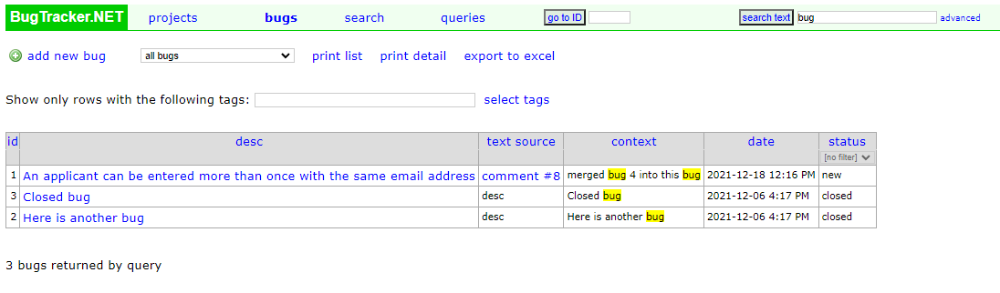

#####################
Search Text (Lucerne)
#####################

Another way to search for a bug is using full text search. In the second text box with the button labled "search text", you can enter any text in there and click the button.  This will return a list of bugs that meet the criteria. 

This uses Lucerne.NET to do the searching and requires the bugs to be fully indexed. If the index has not been built yet, you will not get an error message and it will return no results.
