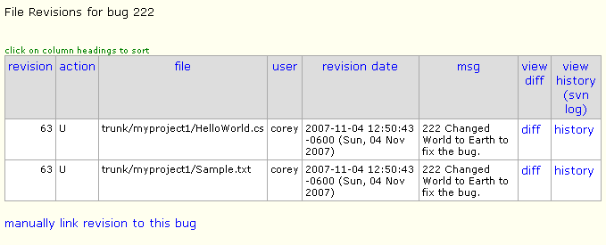

======================
Subversion Integration
======================
The instructions here are for BugTracker.NET's Subversion integration, but the basics are the same for the Git and Mercurial integration too.

If you are not using a version control system, you should start today. A good, easy, choice would be Subversion, along with its excellent Windows client TortoiseSVN. BugTracker.NET has built-in support for integration with Subversion. The files you need for the integration are all in the btnet\subversion folder.

**Installation**

To enable the integration, there are two easy steps:
1. Connect your Subversion server to point to the BugTracker.NET web server using a "hook script".
2. Connect your BugTracker.NET web server to your Subversion server by changing settings in Web.config.
You can put Subversion and BugTracker.NET on the same computer, but you will still ened to configure them both so that they know where each other are.
1. To connect Subversion to BugTracker.NET's web server.

* Copy the file "svn_hook_for_btnet.py" into the "hooks" folder of your Subversion repository. The script is written in Python, so you will need to install Python version 2.5. or 2.6 on your svn server. :

* Open the file in a text editor, like Notepad, and edit it according to the instructions in the file itself. Mainly, you are going to tell the script the URL of the ASP.NET page "svn_hook.asx".
2. To connect BugTracker.NET to your Subversion server, edit at least the following settings in your Web.config. There are other settings you might need to edit depending on your configuration. See Web.config for details.

<add key="EnableSubversionIntegration" value="1"/>
<add key="SubversionPathToSvn" value="C:\Program Files\Subversion\bin\svn.exe"/>
<add key="SvnHookUsername" value="admin"/>
 

When you commit a change, simply type in the BugTracker.NET bug id as the first characters in the checkin comment. Subversion will execute the hook script. The hook script will use the bug id in the comment to associate the checkins with the bug. For example, if your comment is "123 Fixed that bad bug", then when you view bug id 123, you will see a link that will allow you to see exactly what lines of code were changed.

The hook script keeps track of which revisions it has reported to BugTracker.NET using a file "btnet_prev_revision.txt". If you delete that file, the hook script will re-report all revisions. BugTracker.NET has logic that prevents it from inserting duplicate entries in the database. Sometimes it can be useful to have the script report older revisions. For example, if you did a commit to Subversion during a time when the BugTracker.NET web server was unreachable from the svn server. You can also use SQL to hook up revisions that were checked in without a comment, like "update svn_revisions set svnrev_bug = 123 where svnrev_revision = 4"

There are some optional steps you could take to make the integration even nicer. If you use the "TortoiseSVN_integration.bat" from the subversion folder to set the Subversion "bugtraq" properties, then instead of having to enter the BugTracker.NET id at the start of each comments, TortoiseSVN displays a control in the upper right. (see screenshots below). It will even warn you if you have forgetten to enter a number in the field.
 

**Troubleshooting**

Setting up a subversion server is VERY easy, but one area I personally stumbled with was with paths, pointing to a child when I should have been pointing to a parent. Here is an example showing what works.

To create a repository:
C:\>svnadmin create c:\my_parent_folder\my_repository_folder
To start a Subversion server. You could have several repositories under "my_parent_folder":
C:\>svnserve -d -r c:\my_parent_folder
The URL for this repository is:
<add key="SubversionRepositoryUrl" value="svn://127.0.0.1/my_repository_folder"/>
 

Using Subversion Integration

The following screenshots demonstrate what Subversion integration looks like in BugTracker.NET assuming you have everything configured correctly.

**Doing a commit (checkin) using TortoiseSVN:**
.. image:: images/bug_tracker_tort_commit1.gif

**Enter the BugTracker.NET bug id, "222", in the comment text:**
.. image:: images/bug_tracker_tort_commit2.gif

**Subversion confirms the commit. It was Subversion revision #63:**
.. image:: images/bug_tracker_tort_commit3.gif

**The bug in BugTracker.NET. We changed two files, so there are two revision lines associated with this bug:**
.. image:: images/bug_tracker_svn_bug.gif

**If you click "revisions" above, you see the Subversion file revisions related to the bug:**

**Run a "diff" to see what changed:**
.. image:: images/bug_tracker_svn_diff.gif

**View file history, diff between any two versions:**

**View an annotated copy of the file, showing who changed each line and when:**
.. image:: images/bug_tracker_svn_blame.gif