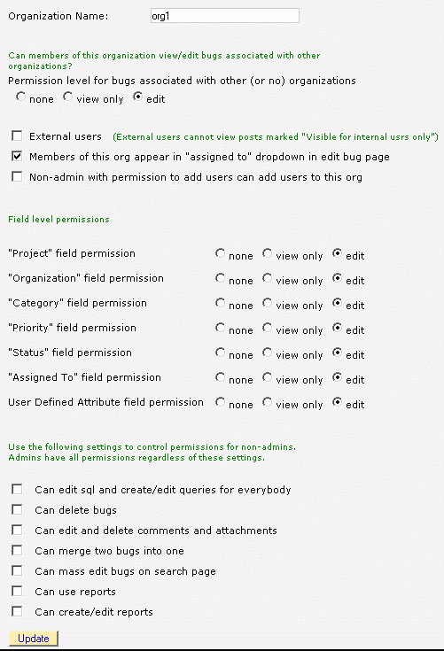
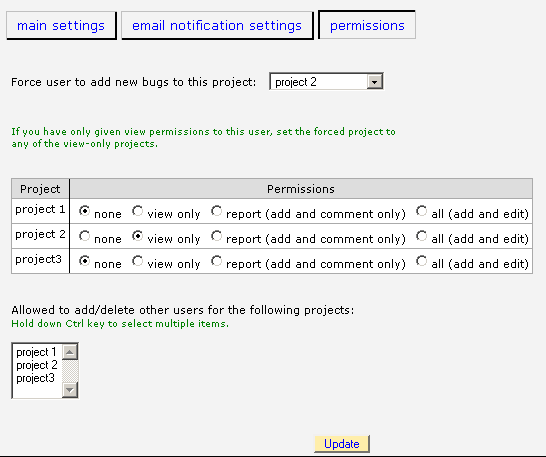
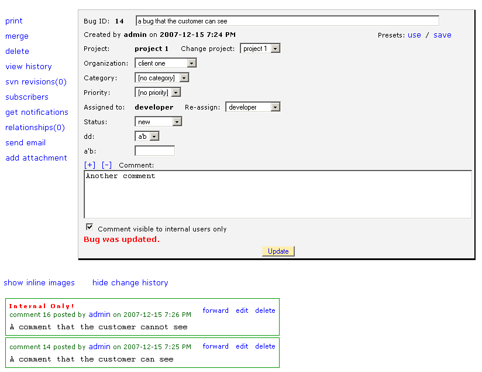

================
User Permissions
================
BugTracker.NET allows you to base permissions on "projects" or "organizations" or both. The terms "projects" and "organizations" are somewhat flexible and maybe even overlapping. BugTracker.NET also recognizes the difference between "internal" and "external" users. Setting up permissions so that they match your situation might require some experimentation. Because you can use both projects and organizations, there could be more than one way to setup the permission scheme that fits your needs. To get you started, here are a few scenarios and how you might use permissions to handle them.

1. Scenario: You are a small team and you trust everybody. You don�t want any permissions to get in the way. You want a simple bug tracker.

Setup: Set "DefaultPermissionLevel" to "2" in Web.config. That gives everybody permission to all projects. You could still use per-project permissions to explicitly revoke permissions for specific users and projects. You can even use the following .css to hide the project and organization fields on the edit bug page:
#row1 {display:none;}
#row2 {display:none;}

2. Scenario: You are using BugTracker.NET internally within your company. You have several project teams. Only members of a given project team are allowed to edit bugs for that team.

Setup: Set "DefaultPermissionLevel" in Web.config to 0. This denies everybody permission to all projects except where permission is explicitly granted. Create a BugTracker.NET project for each project team. Edit users so that they have the "all" permission for the project they are a member of and leave the others set to "none".

3. Scenario: Same as above, but you do want to allow all bugs to be viewable.

Setup: Set "DefaultProjectLevel" in Web.config to 1. Leave the setting for the other projects to "view only".

4. Scenario: Your team has several customers. You want your customers to use BugTracker.NET too, but you don�t want one customer to see another customer's bugs. You also want to be able to post comments to bugs that you don't want the customers to see.

Setup: Set "EnableInternalOnlyPosts" to "1" in Web.config. This allows you to post comments to bugs that user who are marked "external" can't see. Create a BugTracker.NET organization for each customer. Check the "external" flag on the organization. Set "Permission level for bugs associated with other (or no) organizations" to "None". Create another organization naming it something like "Internal" and set "Permission level for bugs associated with other (or no) organizations" to "Add/Edit". When a customer-user adds a bug, it will automatically be associated with the organization, and other customers won't be able to see it. Your internal users will be able to see the bugs for all customers.

5. Scenario: You want people to be able to view bugs without having to create a user account for them.

Setup: Create a user named "guest". There is special logic in BugTracker.NET to handle the guest user differently. First of all, you can't give the guest user permissions any stronger than Reporter. Second, the link to "settings" and the button to "Save search as query" are not available to the guest user. You can also set the Web.config setting "AllowGuestWithoutLogin" to "1" which allows anybody to access your BugTracker.NET as "guest" without logging in at all.

6. Scenario: Some people can see the status but can't change it. Some people are not allowed to even see the "assigned to" field.

Setup: Create an organzation and set the "Status" permission for that organization to "Read Only". Create another organization and set its "Assigned to" permission to "None".

**Organization permissions:**

**Project permissions:**

**Comments only internal users can see:**

